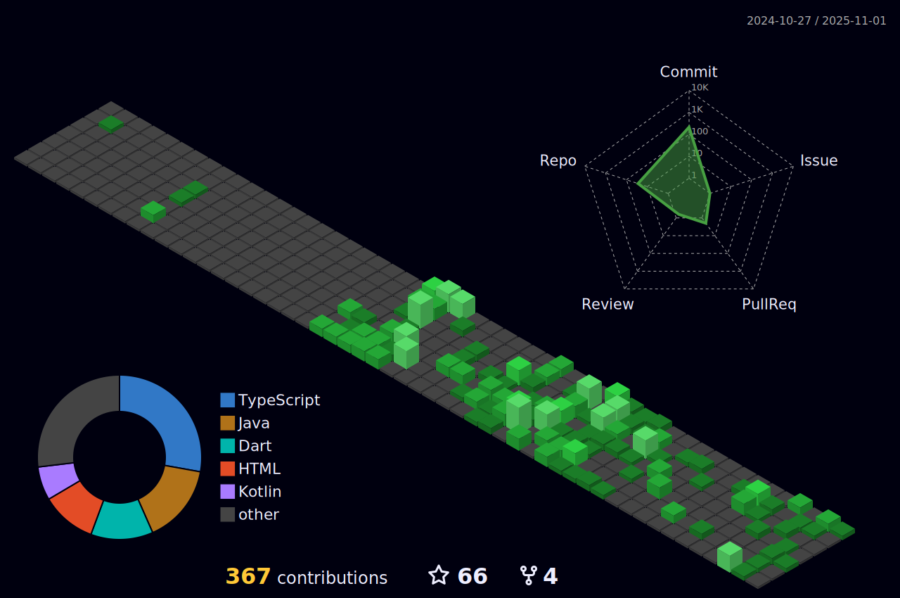

<h1 align="center">Hi 👋, I am Gopal Krushna Sahoo</h1>

 

 

- :telescope: I’m learning as an JAVA  and contributing to backend development.
- 🌱 I’m from Khurda, Odisha, India .

- :seedling: Exploring Technical Content.

- :zap: In my free time, I solve problems on Hackerrank and read tech articles.

- :mailbox:How to reach me: gopalkrushnas063@gamil.com
- 💼 See my resume: **[Resume](https://drive.google.com/file/d/1XtSkhVfQOXI4O8kBOVMYnokLOjOe530j/view?usp=share_link)**
- 💼 See my PortFolio: **[PortFolio](http://gopalkrushna.me/)**

<h2 align="center" border="0" dir="auto"><a id="user-content-my-tech-stack" class="anchor" aria-hidden="true" href="#my-tech-stack"><svg class="octicon octicon-link" viewBox="0 0 16 16" version="1.1" width="16" height="16" aria-hidden="true"><path fill-rule="evenodd" d="M7.775 3.275a.75.75 0 001.06 1.06l1.25-1.25a2 2 0 112.83 2.83l-2.5 2.5a2 2 0 01-2.83 0 .75.75 0 00-1.06 1.06 3.5 3.5 0 004.95 0l2.5-2.5a3.5 3.5 0 00-4.95-4.95l-1.25 1.25zm-4.69 9.64a2 2 0 010-2.83l2.5-2.5a2 2 0 012.83 0 .75.75 0 001.06-1.06 3.5 3.5 0 00-4.95 0l-2.5 2.5a3.5 3.5 0 004.95 4.95l1.25-1.25a.75.75 0 00-1.06-1.06l-1.25 1.25a2 2 0 01-2.83 0z"></path></svg></a>📫 How can you reach me?</h2>

<h3 align="left">Languages and Tools:</h3>
<table align="center">
<tbody>
<tr valign="top">
<td width="25%" align="center">

𝗛𝗧𝗠𝗟𝟱  

</td>
<td width="25%" align="center">

𝗖𝗦𝗦𝟯  

</td>
<td width="25%" align="center">

𝗝𝗮𝘃𝗮𝗦𝗰𝗿𝗶𝗽𝘁  

</td>
<td width="25%" align="center">

𝗝𝗮𝘃𝗮  

</td>
</tr>
<tr valign="top">
<td width="25%" align="center">

𝗦𝗽𝗿𝗶𝗻𝗴 𝗕𝗼𝗼𝘁  

</td>
<td width="25%" align="center">

𝗜𝗻𝘁𝗲𝗹𝗹𝗶𝗝 𝗜𝗗𝗘𝗔  

</td>
<td width="25%" align="center">

𝗦𝗽𝗿𝗶𝗻𝗴 𝗕𝗼𝗼𝘁 𝗧𝗼𝗼𝗹 𝗦𝘂𝗶𝘁 🰠 

</td>
<td width="25%" align="center">

𝗡𝗲𝘁𝗹𝗶𝗳𝘆  

</td>
</tr>
<tr valign="top">
<td width="25%" align="center">

ğ—Ÿğ—¶ğ—»ğ˜‚𘅠 

</td>
<td width="25%" align="center">

𝗛𝗲𝗿𝗼𝗸𝘂  

</td>
<td width="25%" align="center">

𝗚𝗶𝘁  

</td>
<td width="25%" align="center">

𝗩𝗦 𝗖𝗼𝗱𝗲  

</td>
</tr>

<tr valign="top">
<td width="25%" align="center">

𝗥𝗮𝗽𝗶𝗱 𝗔𝗣𝗜  

</td>
<td width="25%" align="center">

𝗛𝗶𝗯𝗿𝗻𝗮𝘁𝗲  

</td>
<td width="25%" align="center">

𝗠𝘆𝗦𝗤𝗟  

</td>
<td width="25%" align="center">

𝗗𝗮𝘁𝗮 𝗦𝘁𝗿𝘂𝗰𝘁𝘂𝗿𝗲 𝗔𝗻𝗱 𝗔𝗹𝗴𝗼𝗿𝗶𝘁𝗵𝗺  

</td>
</tr>
</tbody>
</table>

 

 

<table align="center">
<tbody>
<tr valign="top">
<td width="25%" align="center">
 

</td>
<td width="25%" align="center">
 

</td>
</tr>
</tbody>
</table>

 
 

